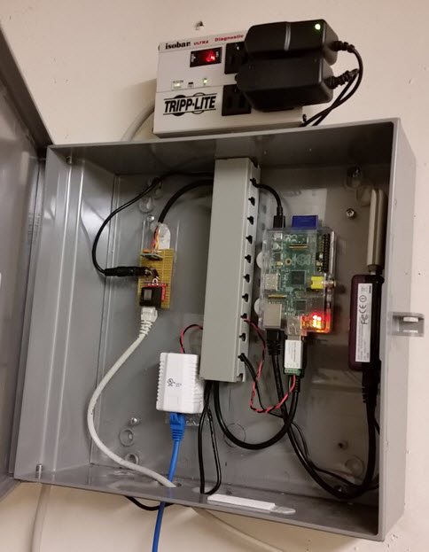

# Mini-Monitor: Raspberry Pi Data Collection System

##### Copyright (c) 2014, Alaska Housing Finance Corporation.  All Rights Reserved.

Licensed under the Apache License, Version 2.0 (the "License");
you may not use this software except in compliance with the License,
as described in the [LICENSE.md file](LICENSE.md).

The Mini-Monitor software is data acquisition software that runs on a [Raspberry Pi computer](https://www.raspberrypi.org/).  It is designed to post the collected data to the [BMON web-based sensor reading database and analysis software](../../../bmon), but the software can be modified to post to other Internet databases.  The Mini-Monitor software has the ability to collect data from a number of different sources, including:

- [Maxim DS18B20 1-Wire Temperature Sensors](http://www.maximintegrated.com/en/products/analog/sensors-and-sensor-interface/DS18B20.html)
- Sensors utilizing the [Maxim DS2406 1-Wire chip](http://www.maximintegrated.com/en/products/digital/memory-products/DS2406.html) to sense the On/Off state of a device.  [Analysis North](http://analysisnorth.com) sells an easily-installed motor/pump/zone valve/gas valve sensor utilizing this chip that can interface to the Mini-Monitor through the 1-Wire network.
- [Burnham Alpine Boilers](http://www.usboiler.net/product/alpine-high-efficiency-condensing-gas-boiler.html) utilizing the Sage controller.  The Mini-Monitor interfaces to the boiler via the boiler's RS485 Modbus interface and extracts numerous sensor and state values from the boiler.
- The [AERCO BMS II Boiler controller](http://www.aerco.com/Products/Accessories/Controls/BMS-II-Model-5R5-384), which controls a set of AERCO boilers.  The Raspberry Pi interfaces via a serial RS232 MODBUS interface.
- Thermistors connected to a [Labjack U3 data acquisition board](http://labjack.com/u3).
- Gauge air pressure measured by an [Energy Conservatory DG-700 Pressure Gauge](http://products.energyconservatory.com/dg-700-pressure-and-flow-gauge/).

The software design is flexible and allows for the easy addition of other data sources.  To add a new data source, an appropriate "Reader" class written in Python must be created, and can then be combined with other Reader classes to create a customized data acquisition system.

Here is a picture of a Mini-Monitor installed in a boiler room connecting to Burnham Alpine Boiler and a string of 1-Wire temperature and motor sensors:

For detailed information about this software: 

### Please see the [Mini-Monitor Documentation](http://mini-monitor-documentation.readthedocs.io/en/latest/index.html)
